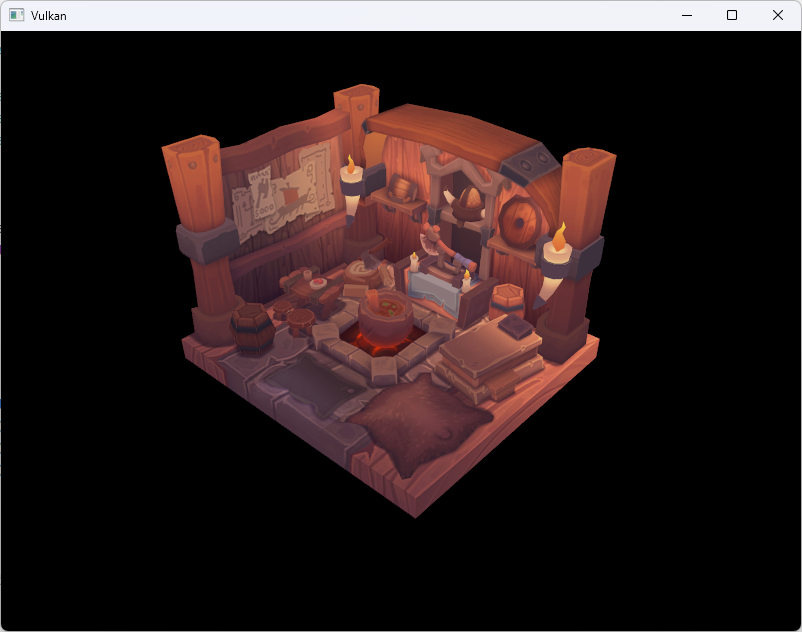
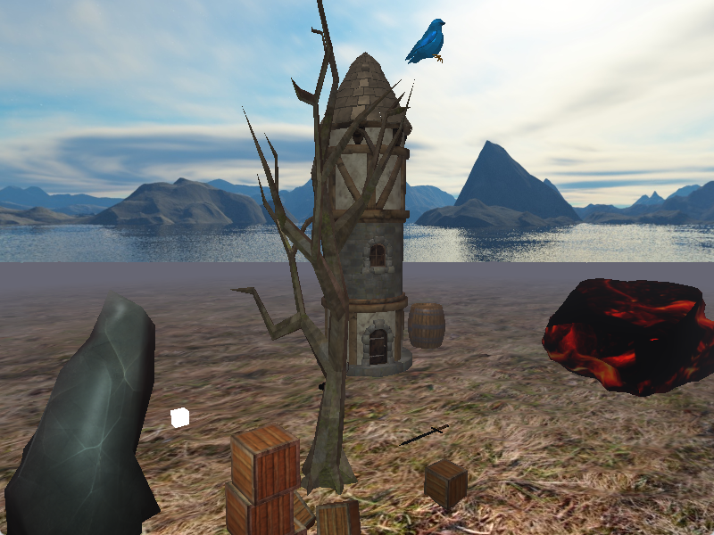
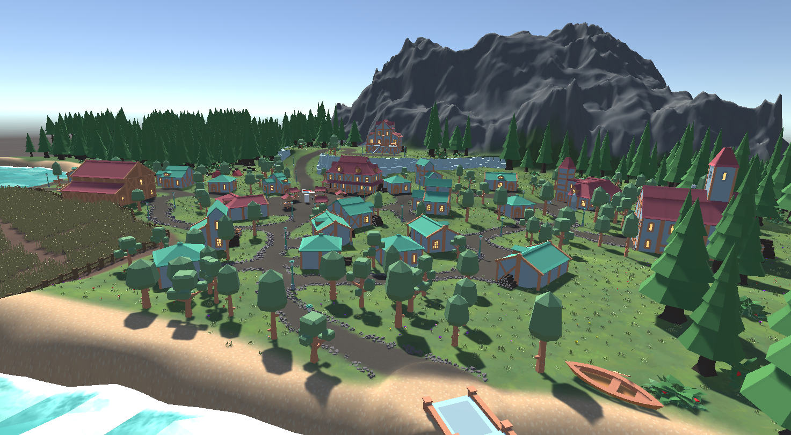

# Some of my projects

## [GWBot](github.com/gwtjxyz/GWBot)

Discord moderation bot with an image auto-detection system based on hash comparisons.

## [Vulkan project (WIP)](https://github.com/gwtjxyz/VulkanRenderEngine)

Under active development; project to learn a modern graphics API while trying to use best modern practices when applicable.

## [OpenGL university project](https://github.com/gwtjxyz/pgr-semestral-project)

Bad code, decent visual showcase of some basic rendering techniques. Terrain is generated using Perlin noise, which is kinda cool.

## [Magitech](https://mravenisko.itch.io/magitech)

Unity team project. I mostly worked on the dialogue system, and I also wrote all the dialogue.

## [Bomberman](https://github.com/gwtjxyz/bomberman)

Very old project, probably not very good code. Can play
Bomberman in your terminal, either local multiplayer or single-player vs AI. Includes power-ups and a scoring system. Built on ncurses so need to run on Linux/Mac or through WSL on Windows.
